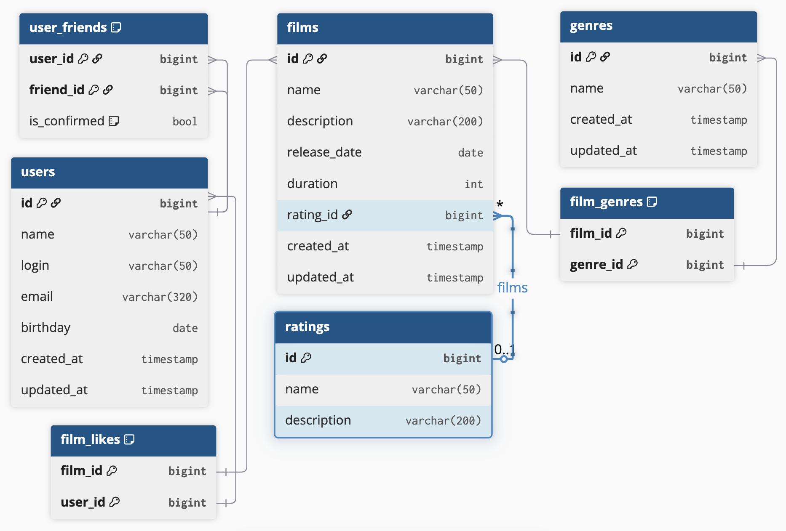

# ER диаграмма


## Примеры запроса
#### Получение всех фильмов c сортировкой по названию
```sql
SELECT *
FROM films
ORDER BY name;
```
#### Получение всех пользователей
```sql
SELECT *
FROM users;
```

#### Получение N наиболее популярных фильмов
```sql
SELECT f.id, f.name 
FROM films AS f 
INNER JOIN film_likes AS fl ON f.id = fl.film_id
GROUP BY f.id 
ORDER BY COUNT(fl.*) DESC
LIMIT 10;
```

#### Список общих друзей с другим пользователем
```sql
SELECT f1.friend_id AS common_friend_id
FROM user_friends f1
INNER JOIN user_friends f2 ON f1.friend_id = f2.friend_id
WHERE f1.user_id = 1
AND f2.user_id = 2
AND f1.is_confirmed = true
AND f2.is_confirmed = true;
```

### Примечание
В ТЗ есть описание для каждого рейтинга поэтому в таблицу ratings добавил description